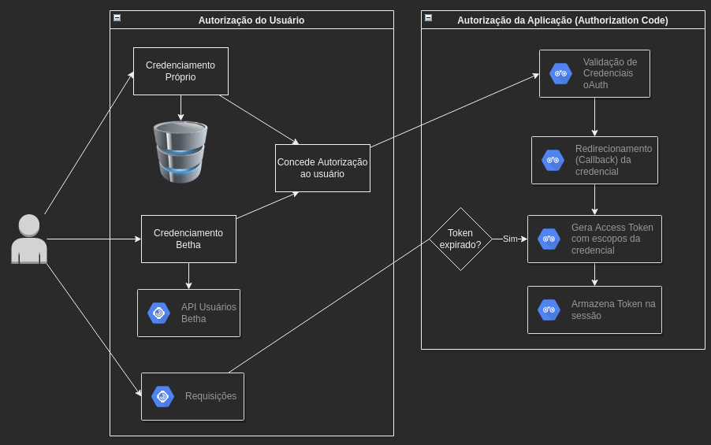

# Plataforma Integração Demonstração
Esse projeto tem como objetivo servir como base para integrações de Produtos de parceiros com a plataforma da Betha Sistemas.

<br><br><br>

# Back-end

## Autenticação

A camada de autenticação/autorização da Plataforma é disponibilizada sobre o protocolo OAuth 2. O OAuth 2 é um protocolo amplamente utilizado, 
principalmente por grandes players de plataforma, provendo acesso aos seus recursos de forma segura para aplicações de terceiros.

## Implementação

**Nessa aplicação de exemplo foi possuí o fluxo conhecido como Authorization code, e as seguintes características podem ser observadas:**
- Durante o login com a Betha, existe um redirecionamento do usuário
- Após login com sucesso, é retornado para uma página da aplicação (callback) junto com um código de autorização
- Esse código de autorização é trocado por um access token
- O access token é armazenado na sessão (mas poderia ser utilizado qualquer outro mecanismo)
- A cada requisição é verificado se o token não expirou, caso tenha sido expirado é iniciado um processo de renovação


<br><br><br>
**Integração com API's do Tributos, para exemplo:**
- Consulta de Imóveis
- Consulta de Contribuintes
- Como header das requisições é utilizado authorization e userAccess, gerados com escopo especifico para o tributos


<br><br><br>
**CRUD de Responsáveis, para exemplo, como algo do domínio local da aplicação:**
- Nela contém exemplos de envio de comando para o cadastro único
- Webhook para receber comandos de Changes do cadastro único


## Executando a aplicação

**Dependencias**
- Java 8 (ou superior)
- Maven 3.5.4 (ou superior)

**Passo a passo**
- Entrar na pasta docker e executar o `comando docker-compose up -d`
- No terminal, executar o comando: ```mvn spring-boot:run```


<br><br><br>

# Front-end


## estrutura-componentes-angular

Exemplo para o [@betha-plataforma/estrutura-componentes](https://github.com/betha-plataforma/estrutura-componentes) com Angular

## Inicializando

Instalar dependências

```
yarn
```

Iniciar servidor de desenvolvimento em http://localhost:4200

```
yarn start
```

A coleção de componentes está sendo definida em [**src/main.ts**](./src/main.ts)

Os estilos estão sendo importadas no [**angular.json**](./angular.json) e sendo configurados em **architect.build.options.styles**

Os componentes estão definidos no [**src/app/app.component.html**](./src/app/app.component.html) e configurados em [**src/app/app.component.ts**](./src/app/app.component.ts)
